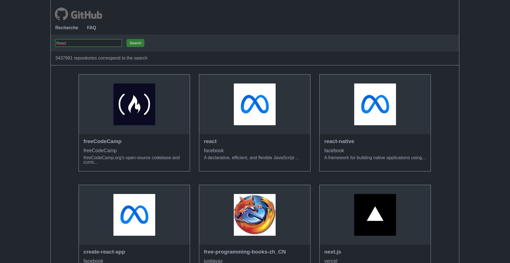

# Search API

This application developed with React allows to find a list of GitHub repositories.



## Software packages :

to run this application on your local server you need:

- yarn or npm
- NodeJs
- React

## Tool :

- [Webpack](https://webpack.js.org/)
- [Babel](https://babeljs.io/)
- [PostCSS](https://postcss.org/)
- [ESLint](https://eslint.org/)
- [React](https://reactjs.org/)

### Webpack

*Task Runner*, *Builder* or *Bundler* ie. task automation: JS transpilation by Babel, Sass -> CSS conversion, build optimization, etc.

- [`webpack`](https://github.com/webpack/webpack) - Packager of modules and resources.
- [`webpack-cli`](https://github.com/webpack/webpack-cli) - Command line interface for Webpack.
- [`webpack-dev-server`](https://github.com/webpack/webpack-dev-server) - Development server for Webpack.
- [`webpack-merge`](https://github.com/survivejs/webpack-merge) - Configuration file merge tool.
- [`cross-env`](https://github.com/kentcdodds/cross-env) - Cross platform configuration.
- Loaders :
  - [`babel-loader`](https://webpack.js.org/loaders/babel-loader/) - Transpiles files with Babel from Webpack.
  - [`sass-loader`](https://webpack.js.org/loaders/sass-loader/) - Loads and transforms the SCSS into CSS.
    - [`sass`](https://github.com/sass/dart-sass) - Sass preprocessor (implementation with Dart).
  - [`postcss-loader`](https://webpack.js.org/loaders/postcss-loader/) - Transforms CSS with PostCSS.
    - [`cssnano`](https://github.com/cssnano/cssnano) - Optimise et compresse PostCSS.
    - [`postcss-preset-env`](https://www.npmjs.com/package/postcss-preset-env) - Optimizes and compresses PostCSS.
  - [`css-loader`](https://webpack.js.org/loaders/css-loader/) - Resolves and imports the CSS into the JS.
  - [`style-loader`](https://webpack.js.org/loaders/style-loader/) - Injects the CSS into the DOM.
  - [`eslint-loader`](https://webpack.js.org/loaders/eslint-loader/) - Using ESLint with Webpack.
  - [`file-loader`](https://webpack.js.org/loaders/file-loader/) - Copy of files used in the JS.
- Plugins :
  - [`clean-webpack-plugin`](https://github.com/johnagan/clean-webpack-plugin) - Delete/clean the build folder.
  - [`copy-webpack-plugin`](https://github.com/webpack-contrib/copy-webpack-plugin) - Copy the files to the build folder.
  - [`html-webpack-plugin`](https://github.com/jantimon/html-webpack-plugin) - Generates an HTML file from a template.
  - [`mini-css-extract-plugin`](https://github.com/webpack-contrib/mini-css-extract-plugin) - Extracts the CSS into separate files.
  - [`css-minimizer-webpack-plugin`](https://github.com/webpack-contrib/css-minimizer-webpack-plugin) - Optimizes and minimizes CSS resources.
  - [`terser-webpack-plugin`](https://github.com/webpack-contrib/terser-webpack-plugin) - Minimizes Javascript.
  - [`bundle-stats`](https://github.com/relative-ci/bundle-stats) - Build analysis.

### Babel

Transpilation ES6/JSX -> ES5.

- [`@babel/core`](https://www.npmjs.com/package/@babel/core) - Transpile ES6+ to an everywhere compatible JavaScript version.
- Presets :
  - [`@babel/preset-env`](https://babeljs.io/docs/en/babel-preset-env) - "Vocabulary" or syntax rules for Babel and ES6+.
  - [`@babel/preset-react`](https://babeljs.io/docs/en/babel-preset-react) - "Vocabulaire" ou règles de syntaxe pour Babel et le JSX (React).
- Plugins :
  - [`@babel/plugin-proposal-class-properties`](https://babeljs.io/docs/en/babel-plugin-proposal-class-properties) - Makes class properties possible.
  - [`@babel/plugin-proposal-object-rest-spread`](https://babeljs.io/docs/en/babel-plugin-proposal-object-rest-spread) - Makes dumping of objects possible.

### ESLint

- [`eslint`](https://github.com/eslint/eslint) - ESLint, linter / JS code analyzer.
- [`babel-eslint`](https://github.com/babel/babel-eslint) - Analyze the Babel code.
- [`eslint-config-airbnb`](https://github.com/airbnb/javascript/tree/master/packages/eslint-config-airbnb) - Airbnb configuration for ESLint.
- Plugins : 
  - [`eslint-plugin-import`](https://github.com/benmosher/eslint-plugin-import) - Analyzes file imports.
    - [`eslint-import-resolver-alias`](https://github.com/johvin/eslint-import-resolver-alias) - Allows to define aliases for folders.
  - [`eslint-plugin-react`](https://github.com/yannickcr/eslint-plugin-react) - Analyze the React code.
  - [`eslint-plugin-react-hooks`](https://github.com/facebook/react/tree/master/packages/eslint-plugin-react-hooks) - Analyzes the hooks of React.
  - [`eslint-plugin-jsx-a11y`](https://github.com/evcohen/eslint-plugin-jsx-a11y) - Analyzes the accessibility of JSX.

### React

- [`react`](https://github.com/facebook/react) - React.
  - [`react-dom`](https://github.com/facebook/react/tree/master/packages/react-dom) - Allows you to inject React components into the DOM.
- [`prop-types`](https://github.com/facebook/prop-types) - Validation of props within the JSX.

---

Scripts
-------

```sh
# Avec yarn
yarn {script}

# Avec npm
npm run {script}
```

- `start`: Start the development server.
- `build`: Starts the construction of the production version.
- `lint`: Displays errors in the code.
- `lint:fix`: Tries to correct some of the errors in the code.
- `clean`: Delete the folder `dist/`.
- `clean:all`: Delete `dist/`, `node_modules/` and the files `lock`.

